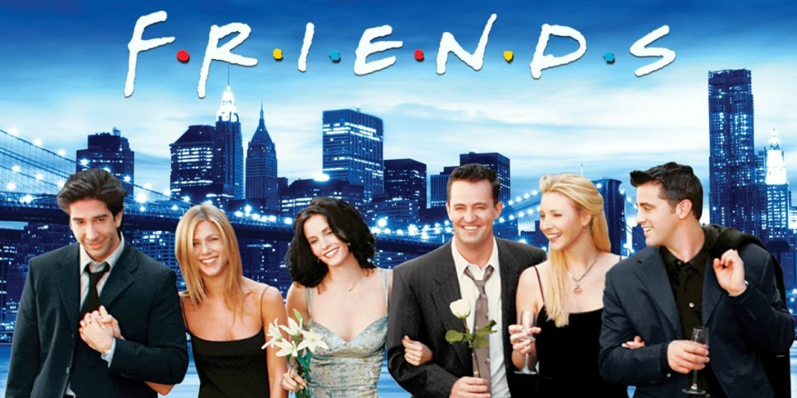
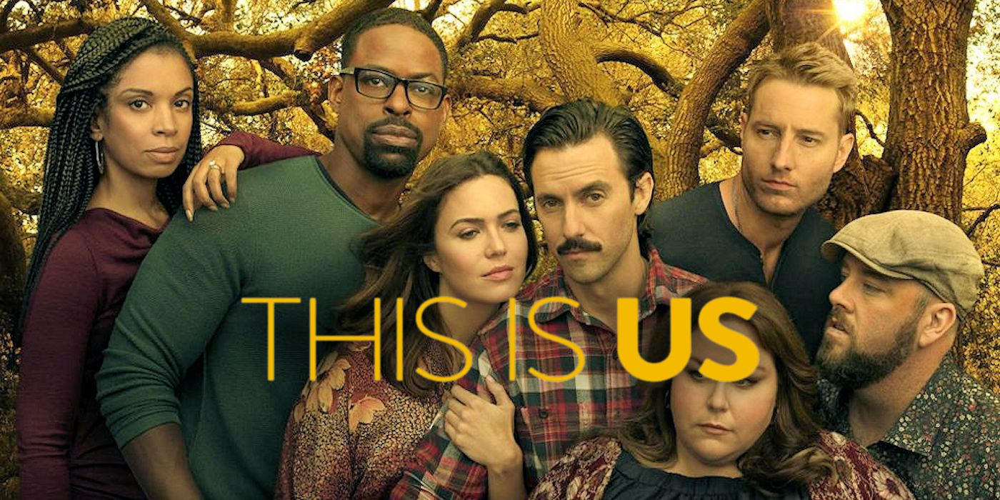
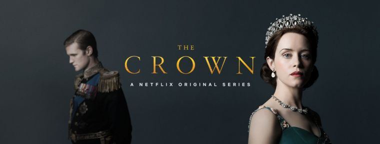
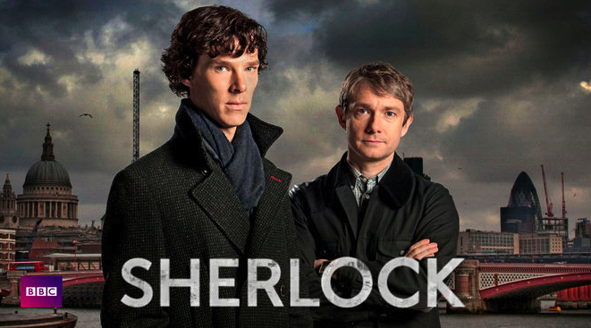
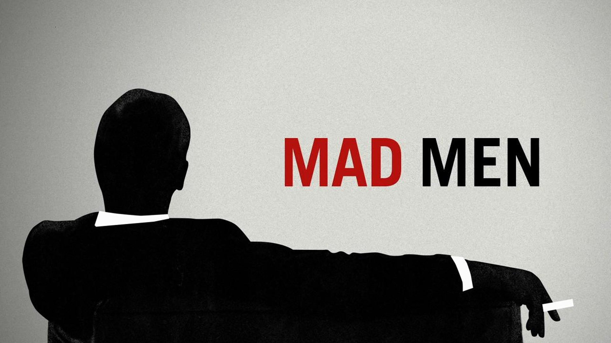

# Title


# Introduction

Prepare a list 10 work (could be video games, movies, TV series, books or music)
For each of them you need to display:
- Titre
- Une image d'illustration
- Un lien (bande annonce)
- Catégorie
- L'auteur
- Description

# Content




| Title      | Friends  |
|-------------|---|
| Link        | [trailer](https://www.youtube.com/watch?v=hDNNmeeJs1Q&ab_channel=LifeOfWorld)  |
| Category    | Comedy  |
| Writer      | Marta Kauffman & David Crane  |
| Description | Follows the personal and professional lives of six twenty to thirty-something-year-old friends living in Manhattan.  |


*****




| Title      | This is us  |
|-------------|---|
| Link        | [trailer](https://www.youtube.com/watch?v=OkTEQwsE8l4&ab_channel=FoxHomeEnt)  |
| Category    | Comedy  |
| Writer      | Dan Fogelman  |
| Description | A heartwarming and emotional story about a unique set of triplets, their struggles and their wonderful parents.  |

******


| Title      | The Crown  |
|-------------|---|
| Link        | [trailer](https://www.youtube.com/watch?v=JWtnJjn6ng0&ab_channel=Netflix)  |
| Category    | Drama and History  |
| Writer      | Peter Morgan |
| Description | Follows the political rivalries and romance of Queen Elizabeth II's reign and the events that shaped the second half of the twentieth century.  |

******


| Title      | Sherlock  |
|-------------|---|
| Link        | [trailer](https://https://www.youtube.com/watch?v=IrBKwzL3K7s&ab_channel=eleanorcreates)  |
| Category    | Crime, Mystery and Drama |
| Writer      | Mark Gatiss, Steven Moffat |
| Description | A modern update finds the famous sleuth and his doctor partner solving crime in 21st century London.  |

******



| Title      | Mad Men  |
|-------------|---|
| Link        | [trailer](https://www.youtube.com/watch?v=RTMk-xy2dTY&ab_channel=BingeWatcher)  |
| Category    | Drama |
| Writer      | Matthew Weiner |
| Description | A drama about one of New York's most prestigious ad agencies at the beginning of the 1960s, focusing on one of the firm's most mysterious but extremely talented ad executives, Donald Draper.|

******


| Title      | How I met your mother  |
|-------------|---|
| Link        | [trailer](https://www.youtube.com/watch?v=aJtVL2_fA5w&ab_channel=CokeNpopcorn)  |
| Category    | Comedy, Romance |
| Writer      | Carter Bays, Craig Thomas |
| Description | A father recounts to his children - through a series of flashbacks - the journey he and his four best friends took leading up to him meeting their mother.|

******


| Title      | How I met your mother  |
|-------------|---|
| Link        | [trailer](https://www.youtube.com/watch?v=aJtVL2_fA5w&ab_channel=CokeNpopcorn)  |
| Category    | Comedy, Romance |
| Writer      | Carter Bays, Craig Thomas |
| Description | A father recounts to his children - through a series of flashbacks - the journey he and his four best friends took leading up to him meeting their mother.|

******


# Technologies


# Setup
```git
git init
git clone (url)
```


# Sources

# Contributing
Pull requests are welcome. For major changes, please open an issue first to discuss what you would like to change.

Please make sure to update tests as appropriate.

## License
[MIT](https://choosealicense.com/licenses/mit/)
